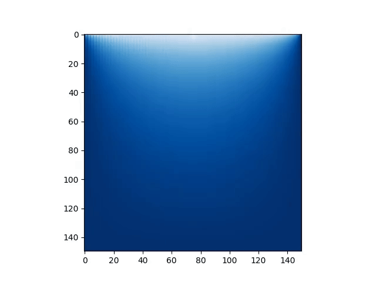

# Lightning_modeling
### Численное моделирование электрических разрядов в атмосфере: метод диэлектрического пробоя.

В данной работе представлена стохастически-детерминистическая модель симуляции молний с использованием стохастической модели диэлектрического пробоя (DBM), которая позволяет воспроизводить фрактальные структуры молний. Эта модель описывает процесс электрического разряда, как сложный и случайный процесс, где пробой происходит по случайно образующимся путям, что позволяет создавать реалистичные структуры, схожие с естественными физическими явлениями.

  

